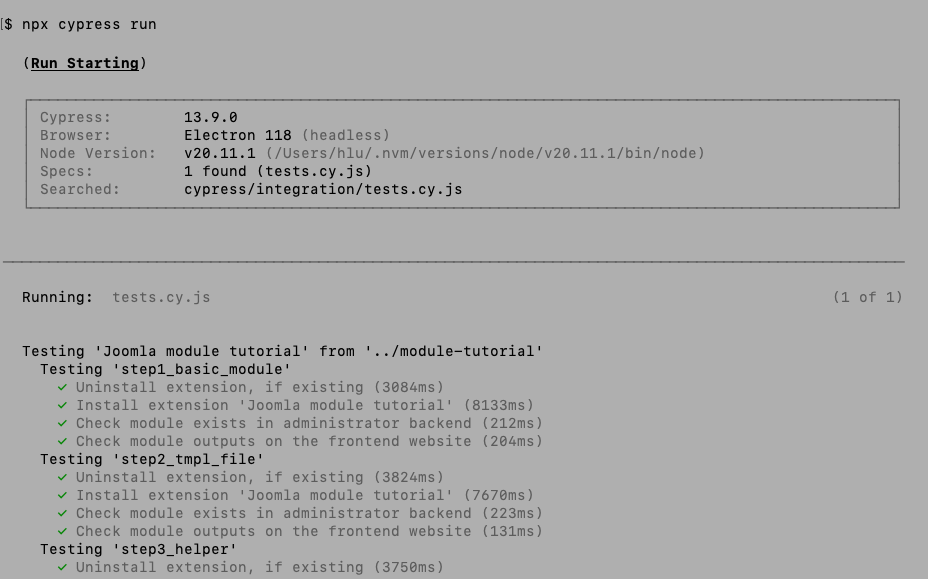

# Automated Tests for Joomla Developer Manuals

All the Joomla developer manual tutorial samples from [../module-tutorial](../module-tutorial) can be automatically tested in a web browser using Cypress.

## Installation

[Git](https://git-scm.com/), [Cypress](https://www.cypress.io//) and [npm](https://www.npmjs.com/) are required and must be installed. In addition, a target Joomla installation with the language en-GB for the Joomla admin user is required.

The tests are based on Node module [joomla-cypress](https://github.com/joomla-projects/joomla-cypress/). 

Perform the following steps on the command line:

1. Clone the repository
```
git clone --depth 1 https://github.com/joomla/manual-examples
```
2. Change to the `tests` sub-directory
```
cd manual-examples/tests
```
3. Copy template `cypress.config.dist.js` to the Cypress configuration file `cypress.config.js`:
```
cp cypress.config.dist.js cypress.config.js
```
4. In the file `cypress.config.js` adjust the three values `joomlaBaseURL`, `joomlaAdminUserName` and `joomlaAdminUserPassword` if necessary.
5. Install node modules:
```
npm install
```

## Test Run

Each example from the module-tutorial directory is tested with the following steps:
* Before each test, delete the module if it already exists.
* Install the module, publish it, display it on all pages, and place it in the `sidebar-right`.
* Verify that the module exists in the administrator backend view.
* Check the module on the website frontend, ensuring it displays with the correct title and content.

Run tests for all `module-tutorial` examples with headless Cypress:
```
npx cypress run
```



Run a test for one example only:
```
npx cypress run --env test=step1_basic_module
```

You can run Cypress with GUI to watch the web browser actions and see all the logging output:
```
npx cypress open
```

And you can combine both by running a single example in the Cypress GUI:
```
npx cypress open --env test=step2_tmpl_file
```

:point_right: After each test, the module remains installed and can be inspected manually in the target Joomla.

:point_right: In order to have the option of using a remote target Joomla, the plugin is installed as a ZIP file. You will find the most recently created ZIP archive in the `cypress/fixtures` folder.

## Logging

In Cypress GUI mode, you can see the log messages. The log messages created by this test are using `****`, for example:
```
log **** installAndConfigure ****
log **** directory: 'step1_basic_module'
log **** moduleName: 'Joomla module tutorial'
log **** absolutePath: '/Users/hlu/Desktop/manual-examples/module-tutorial/step1_basic_module'
```
